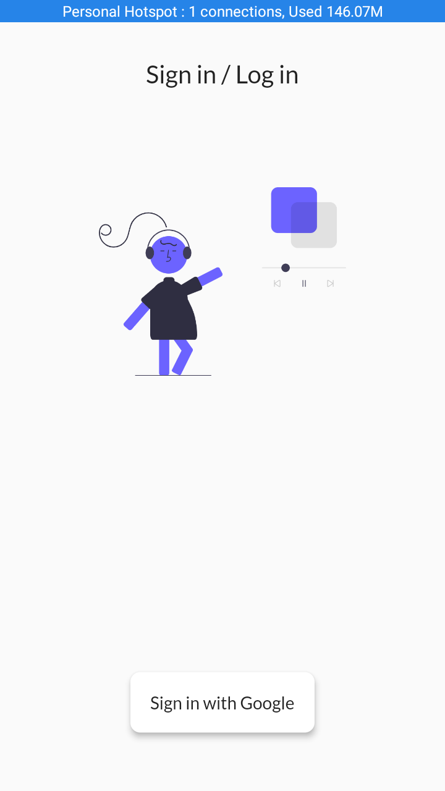
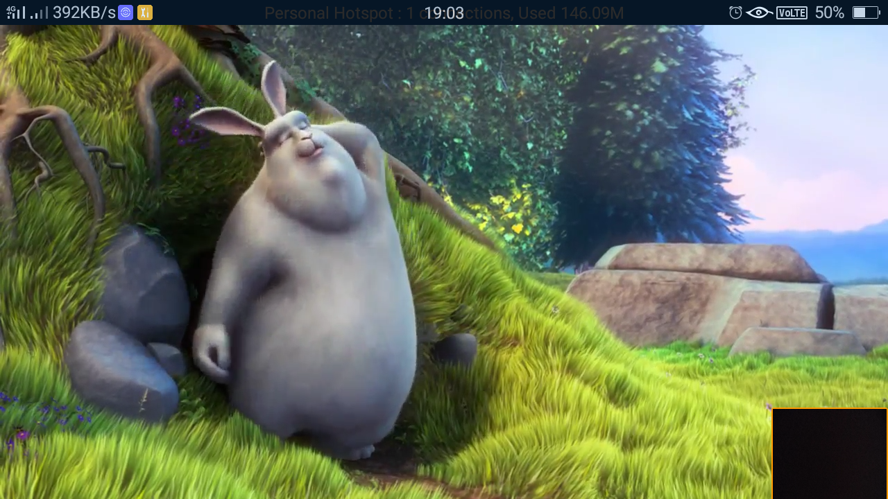
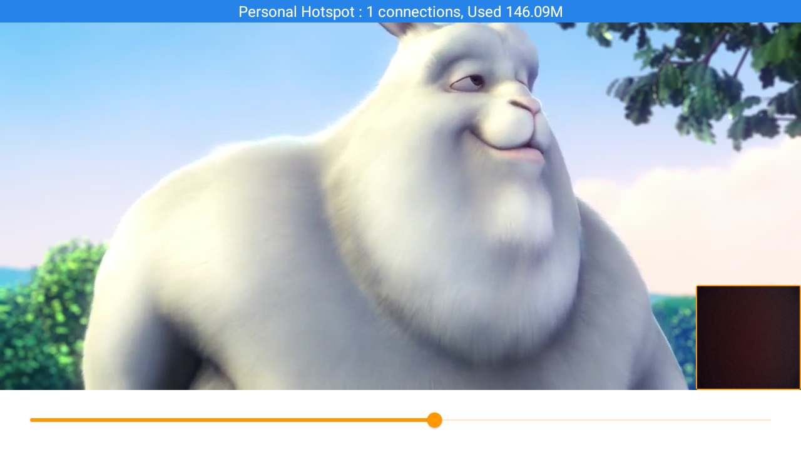

# player

PlayerX.
- [Download APK](app-arm64-v8a-release.apk)

# Demo 
- [Watch](https://drive.google.com/file/d/1IFjkz-rWozvOAjC1J5Ha-swpKmp9zeCM/view?usp=sharing)
# Assignment Problems Completed
- Build a simple Flutter app to play a video in fullscreen landscape mode with a slider bar to control the volume in the video.
- Stream the users devices front camera feed (if exists) in a small box above the video player on the bottom right corner of the screen.
- Build persistent firebase authentication.

## Getting Started

This project is a starting point for a Flutter application.

A few resources to get you started if this is your first Flutter project:

- [Lab: Write your first Flutter app](https://flutter.dev/docs/get-started/codelab)
- [Cookbook: Useful Flutter samples](https://flutter.dev/docs/cookbook)

For help getting started with Flutter, view our
[online documentation](https://flutter.dev/docs), which offers tutorials,
samples, guidance on mobile development, and a full API reference.
